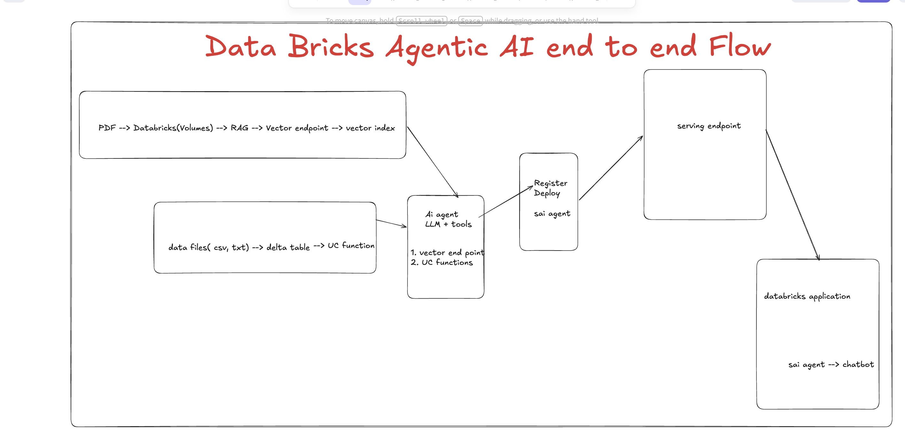
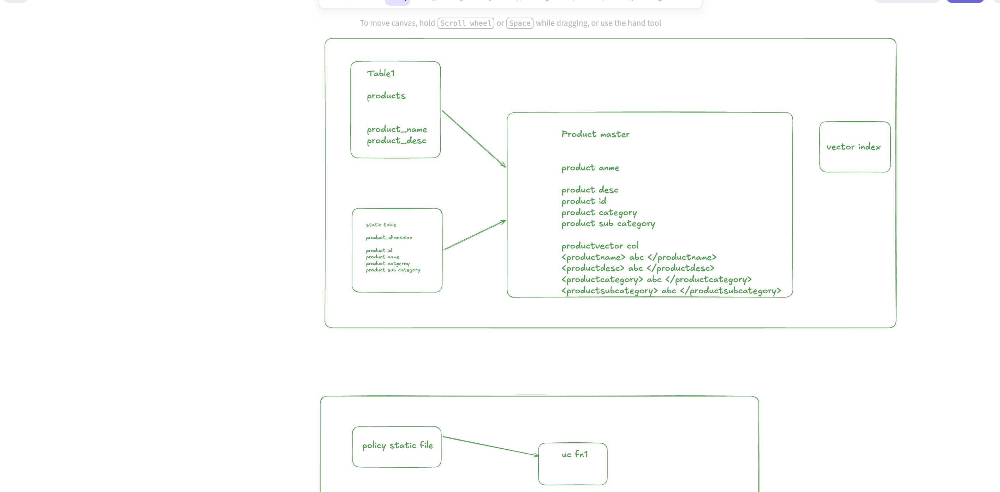
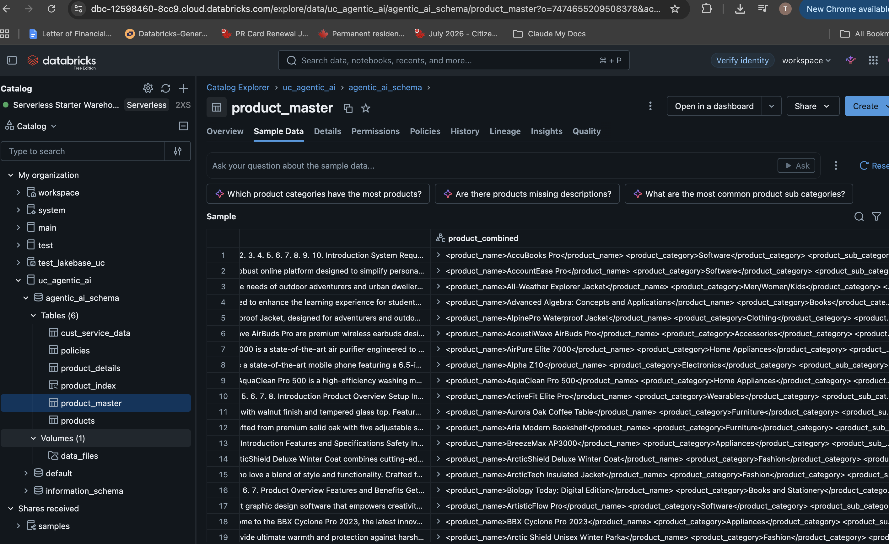
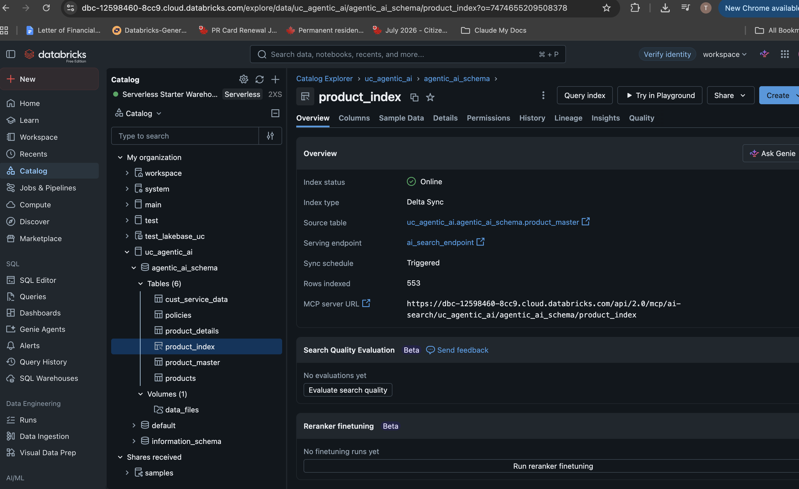
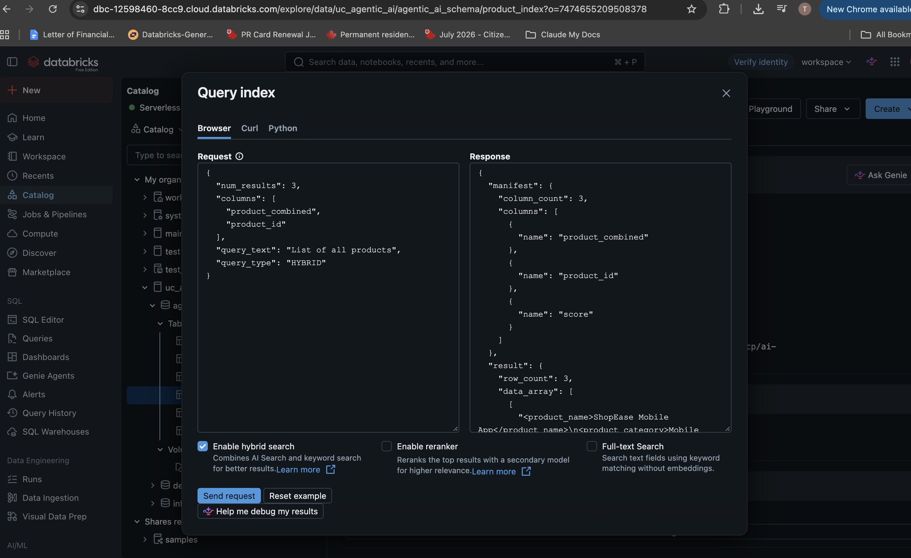
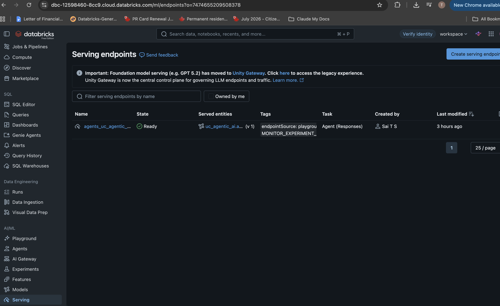
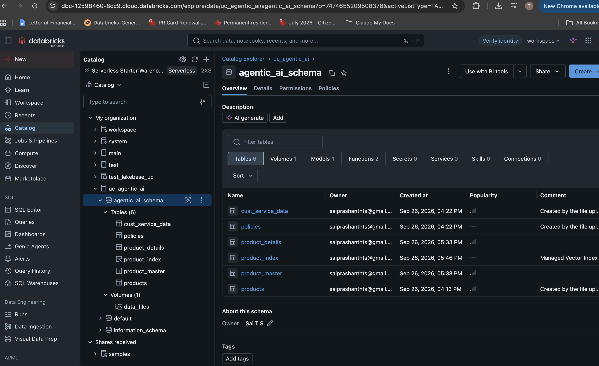
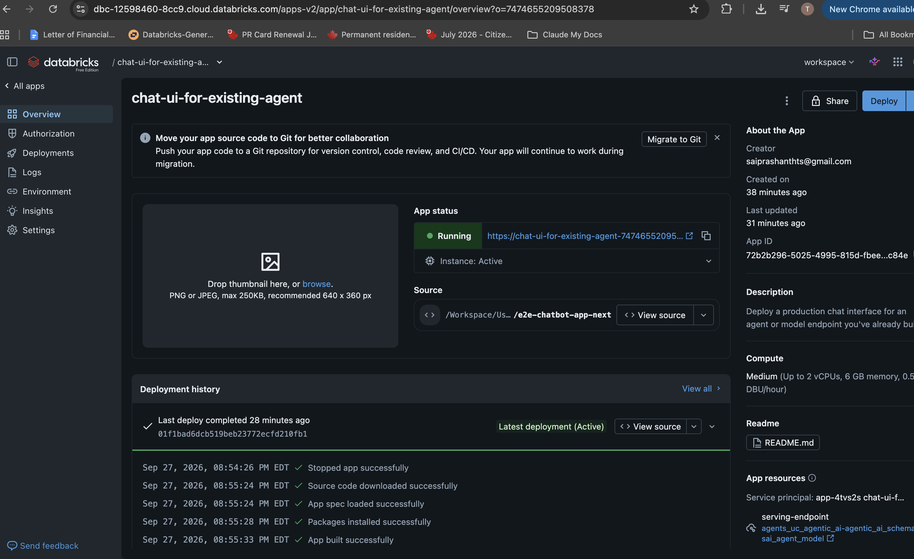
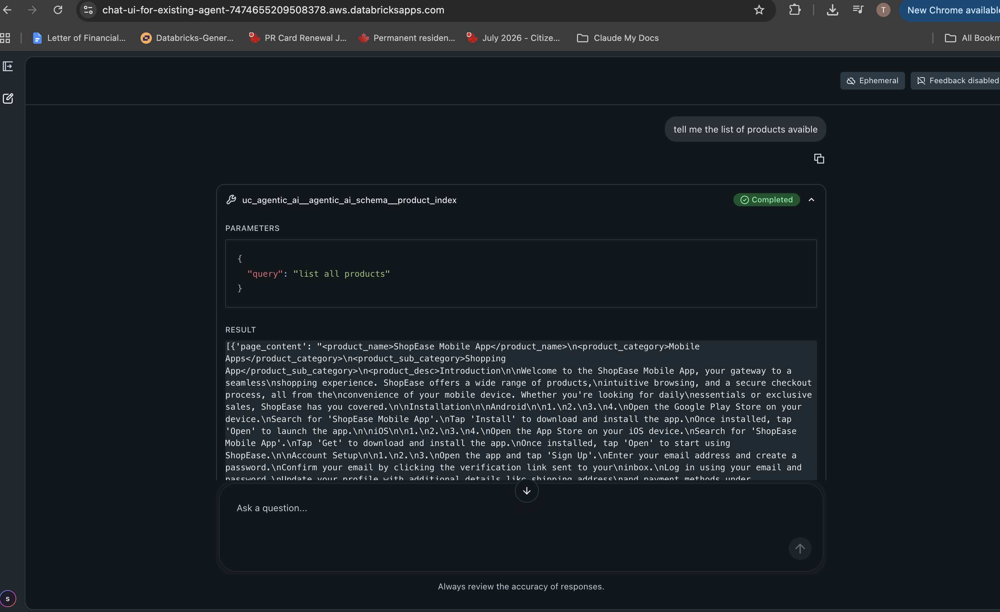

# Databricks Agentic AI — Product Assistant

An end-to-end **agentic AI** solution built entirely on Databricks: a Unity Catalog vector index + two UC functions are wired up as **tools** for an LLM agent, the agent is registered and deployed to a Model Serving endpoint, and a **Databricks App** (chat UI) is deployed in front of it for end users.

This repo currently hosts one use case — **Products** — built from the [`e2e-chatbot-app-next`](./e2e-chatbot-app-next) chat UI template.

## Architecture



```
PDF ──► Volumes ──► RAG ──► Vector Search endpoint ──► Vector index ─┐
                                                                      │
data files (csv/txt) ──► Delta table ──► UC function ────────────────┤
                                                                      ▼
                                                          AI Agent (LLM + tools)
                                                          1. Vector index (product_index)
                                                          2. UC functions (policy, customer data)
                                                                      │
                                                                      ▼
                                                        Register + Deploy (MLflow)
                                                                      │
                                                                      ▼
                                                             Model Serving endpoint
                                                                      │
                                                                      ▼
                                                   Databricks App (chat-ui-for-existing-agent)
```

The agent has three tools available to it at inference time:

1. **Vector search** over `product_index` — semantic retrieval of product info.
2. **UC function 1** — reads a policy reference file for return/shipping/warranty policy answers.
3. **UC function 2** — reads customer service data for order/customer lookups.

## Data pipeline: building the product knowledge base



Two source tables are combined into a single denormalized `product_master` table, which is then synced to a Databricks Vector Search index:

| Source | Columns |
|---|---|
| `products` | `product_name`, `product_desc` |
| `product_dimension` (static reference table) | `product_id`, `product_name`, `product_category`, `product_sub_category` |

These are joined into **`product_master`**:

- `product_id`, `product_name`, `product_desc`, `product_category`, `product_sub_category`
- `product_combined` — a single XML-tagged text column (`<productname>...</productname><productdesc>...</productdesc>...`) used as the embedding source for the vector index

`product_master` is synced (Delta Sync, triggered) into the **`product_index`** Vector Search index, served by `ai_search_endpoint`.

## Tools: Unity Catalog functions


| Source | UC function | Purpose |
|---|---|---|
| Policy static file | `uc fn1` | Answers policy questions (returns, shipping, warranty) |
| Customer service static table | `uc fn2` | Looks up customer/order data |

Both functions, plus the `product_index` vector index, are registered as tools on the agent (`AI agent = LLM + tools`).

## Unity Catalog layout

Everything lives under a single UC schema, `uc_agentic_ai.agentic_ai_schema`:


| Object | Type | Notes |
|---|---|---|
| `products` | Table | Raw product name/description |
| `product_dimension` | Table | Static product category reference |
| `product_master` | Table | Denormalized product table (source for the vector index) |
| `product_index` | Vector index | 553 rows, Delta Sync, online |
| `policies` | Table | Source for UC function 1 |
| `cust_service_data` | Table | Source for UC function 2 |
| `data_files` | Volume | Raw file landing zone (PDFs, csv, txt) |

`product_master` sample data — structured columns and the combined embedding column used by the vector index:




Querying the deployed index directly (hybrid search over `product_combined`):



## Agent: register, deploy, serve

The agent (`sai_agent`) is registered via MLflow and deployed as a Model Serving endpoint (`agents_uc_agentic_ai-agentic_ai_schema-sai_agent_model`, task: **Agent (Responses)**).




## Chat UI: Databricks App

The serving endpoint is fronted by a **Databricks App** deployed from the [`e2e-chatbot-app-next`](./e2e-chatbot-app-next) template, pointed at the existing agent endpoint instead of provisioning a new one.



In the chat, tool calls the agent makes (e.g. a `product_index` vector search) are shown inline with their parameters and raw results, so you can see exactly what the agent retrieved before it answers:



See [`e2e-chatbot-app-next/README.md`](./e2e-chatbot-app-next/README.md) for how to run the chat UI locally and deploy it via Databricks Asset Bundles.

## Bonus: ad-hoc querying via Claude Code + Databricks MCP

For local development/debugging, the workspace also exposes a **remote MCP server** (SQL execute / read-only execute / poll result) that Claude Code can connect to directly using a Databricks PAT + MCP remote URL — useful for quick "what's my schema" / "list my tables" style questions against the workspace without leaving the terminal.


## Screenshots

All diagrams and screenshots referenced above live in [`screenshots/`](./screenshots). Add or replace images there as the solution evolves — keep the numeric prefix so ordering in this README stays consistent, or update the image paths above if you rename/add files.
